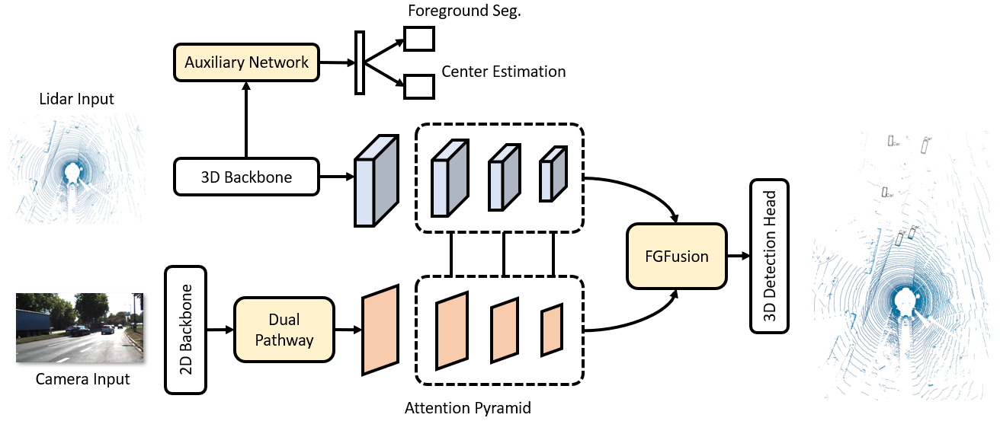

# FGFusion: Fine-Grained Lidar-Camera Fusion for 3D Object Detection



## Abstract
Lidars and cameras are critical sensors that provide complementary information for 3D detection in autonomous driving. While most prevalent methods progressively downscale the 3D point clouds and camera images and then fuse the high-level features, the downscaled features inevitably lose low-level detailed information. In this paper, we propose Fine-Grained Lidar-Camera Fusion (FGFusion) that make full use of multi-scale features of image and point cloud and fuse them in a fine-grained way. First, we design a dual pathway hierarchy structure to extract both high-level semantic and low-level detailed features of the image. Second, an auxiliary network  is introduced to guide point cloud features to better learn the fine-grained spatial information. Finally, we propose multi-scale fusion (MSF) to fuse the last N feature maps of image and point cloud. Extensive experiments on two popular autonomous driving benchmarks, i.e. KITTI and Waymo, demonstrate the effectiveness of our method.

## Main Results

#### KITTI

|           | Easy  | Mod.  | Hard  |
|-----------|-------|-------|-------|
|Car        | 92.38 | 84.96 | 83.84 | 
|Pedestrian | 72.63 | 65.07 | 59.21 |
|Cyclist    | 90.33 | 74.19 | 70.84 |

#### Waymo

|           |     L1      |     L2      |
|-----------|-------------|-------------|
|Vehicle    | 81.92/81.44 | 73.85/73.34 |
|Pedestrian | 85.73/82.85 | 78.81/76.14 |

## Reference
If you find our paper useful, please kindly cite us via:
```
@article{yin2023fgfusion,
  title={FGFusion: Fine-Grained Lidar-Camera Fusion for 3D Object Detection},
  author={Yin, Zixuan and Sun, Han and Liu, Ningzhong and Zhou, Huiyu and Shen, Jiaquan},
  journal={PRCV},
  year={2023}
}
```

## Contact
This repository is implemented by Zixuan Yin (yinzixuan@nuaa.edu.cn)
